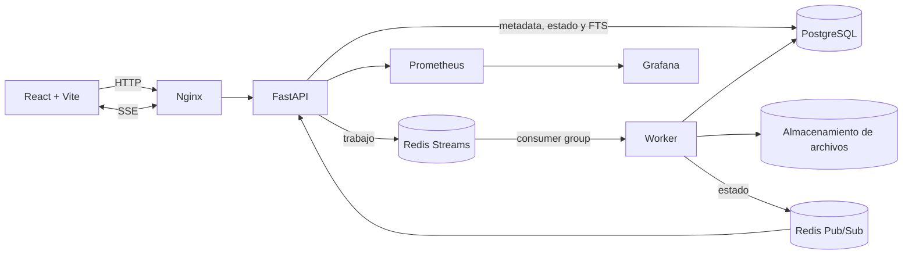
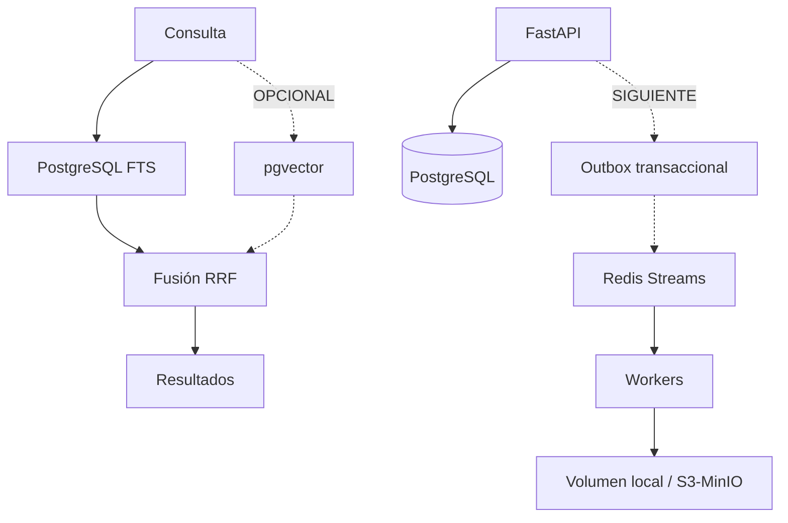

# AGENTS.md

## 1. Propósito y jerarquía de decisiones

Este repositorio implementa la prueba técnica **Buscador y Visor de
Documentos Técnicos**. El objetivo es entregar una solución funcional,
medible, segura, observable y fácil de sustentar; no acumular tecnologías.

Cuando dos documentos entren en conflicto, usar este orden de autoridad:

1. enunciado oficial de la prueba;
2. criterios de evaluación comunicados por correo por el equipo evaluador;
3. comportamiento verificado por pruebas y contratos públicos;
4. `README.md` y `docs/architecture.md`;
5. este archivo como guía de trabajo y evolución;
6. propuestas o conversaciones previas.

`AGENTS.md` define el norte arquitectónico, pero no autoriza a afirmar que una
capacidad existe antes de implementarla y verificarla.

Regla principal:

> Una tecnología sólo se incorpora cuando resuelve un problema concreto,
> mejora un criterio evaluable y puede explicarse en 20--30 segundos.

Principios:

- cumplir primero el alcance obligatorio;
- preservar siempre una ruta simple y funcional;
- mejorar de forma incremental, reversible y verificable;
- medir antes de optimizar;
- mantener IA y búsqueda semántica fuera del camino crítico obligatorio;
- no reescribir componentes funcionales sin una ganancia demostrable;
- documentar los trade-offs y la evidencia de cada cambio.

## 2. Lenguaje de estado

Toda propuesta de arquitectura, documentación o sustentación debe usar una de
estas etiquetas:

- **REQUERIDO:** exigido por el enunciado.
- **BASE:** implementado y verificado en el repositorio.
- **SIGUIENTE:** mejora priorizada que todavía debe implementarse.
- **OPCIONAL:** diferenciador condicionado a tiempo y evidencia.
- **FUERA DE ALCANCE:** evolución razonable, no parte de la entrega actual.

No mezclar `BASE` y `OPCIONAL` en diagramas o discursos. Una funcionalidad
opcional sólo pasa a `BASE` después de tener código, pruebas, documentación y
una demostración reproducible.

## 3. Criterios oficiales de evaluación y alcance obligatorio

### 3.1 Criterios comunicados por el equipo evaluador

El correo de la prueba establece expresamente que la evaluación considera:

1. **Código limpio y buenas prácticas de desarrollo.** Nombres que expresen
   intención, módulos cohesivos, funciones enfocadas, errores explícitos,
   formato consistente y ausencia de código muerto o artefactos generados.
2. **Principios SOLID y DRY.** Las dependencias deben apuntar hacia dominio y
   casos de uso; PostgreSQL, Redis, filesystem y frameworks son adaptadores.
   Reutilizar reglas reales, pero no crear abstracciones genéricas ni capas de
   paso para aparentar SOLID.
3. **Seguridad y validaciones.** Validar datos, tipo, firma, tamaño y contenido
   del archivo; usar consultas parametrizadas, configuración externa, CORS
   explícito, mensajes seguros y ningún secreto o contenido sensible en logs.
4. **Sustentación.** Cada decisión relevante debe poder explicarse con su
   problema, alternativa descartada, trade-off, evidencia y fallback. La demo
   debe mostrar también un caso inválido y un modo de fallo controlado.
5. **Pruebas unitarias.** Dominio y casos de uso deben probar caminos felices,
   bordes y errores sin infraestructura real. Las pruebas de integración son
   complementarias y siguen siendo necesarias para PostgreSQL, Redis y SSE.

Estos criterios son transversales: una funcionalidad no suma si empeora
claridad, seguridad o capacidad de prueba sin una justificación demostrable.
Antes de agregar tecnología, preferir una mejora observable en uno de estos
cinco criterios.

### 3.2 Alcance funcional obligatorio

La solución debe conservar, como mínimo:

- carga individual y capacidad de carga masiva de TXT, Markdown y PDF;
- metadatos: título, autor, categoría, etiquetas y versión;
- respuesta asíncrona inmediata con ID de seguimiento y `PROCESSING`;
- búsqueda en título, metadatos y contenido mediante un índice full-text;
- prohibición de `LIKE`/`ILIKE` o equivalentes no indexados para búsqueda;
- paginación, ranking y resaltado de coincidencias;
- visor dedicado de contenido y metadatos sin descarga obligatoria;
- notificación `INDEXED`/`ERROR` por SSE, sin polling en la aplicación;
- validación, errores estructurados y variables de entorno;
- pruebas de los caminos críticos;
- Docker Compose reproducible;
- `docs/architecture.md` y `docs/ia.md` actualizados.

Interpretación del SLA: la búsqueda debe tener p95 menor o igual a 1000 ms
bajo un conjunto de datos y concurrencia documentados. Una respuesta inferior
a 400 ms es mejor; nunca agregar espera artificial.

## 4. Arquitectura base que debe preservarse



Responsabilidades:

- **React/Vite:** carga, seguimiento, búsqueda, paginación y visor.
- **Nginx:** sirve el frontend, actúa como reverse proxy, limita requests y
  evita buffering de SSE. Puede vivir en el contenedor del frontend; no es
  obligatorio crear un servicio separado.
- **FastAPI:** contratos HTTP, validación, casos de uso y SSE.
- **PostgreSQL:** fuente de verdad y motor FTS.
- **Redis Streams:** transporte durable de trabajos asíncronos.
- **Redis Pub/Sub:** señal de baja latencia; nunca fuente de verdad.
- **Worker:** extracción, indexación y tareas pesadas.
- **Prometheus/Grafana:** observabilidad opcional para la ejecución, pero sus
  métricas deben formar parte del diseño.

La búsqueda síncrona nunca debe depender de Redis, workers, embeddings o un
LLM. Los documentos ya indexados deben seguir siendo buscables si esas piezas
fallan.

## 5. Arquitectura evolutiva

Las mejoras deben conectarse a la base mediante puertos estables, sin romper el
flujo obligatorio:



Orden recomendado de evolución:

1. robustecer requisitos y pruebas;
2. cerrar brechas de carga masiva, versionado y correlación;
3. mejorar observabilidad y resiliencia;
4. agregar búsqueda semántica sólo si la base continúa cumpliendo el SLA;
5. incorporar capacidades empresariales únicamente con un escenario real.

## 6. PostgreSQL, dominio y versionado

PostgreSQL es la fuente durable de verdad. Redis no debe almacenar la única
copia de metadatos, versiones o estados.

Modelo objetivo:

```text
Document
- id
- logical_key
- title
- author
- category
- tags
- current_version_id
- created_at

DocumentVersion
- id
- document_id
- version
- filename
- content_type
- size_bytes
- content_hash
- storage_key
- status
- content
- search_vector
- created_at / indexed_at
```

La metadata de versión en una sola tabla es válida como base. Separar
`Document` y `DocumentVersion` pasa a ser **SIGUIENTE** cuando se requiera:

- historial real;
- reindexación sin perder versiones;
- detectar si una carga crea una versión o repite contenido;
- seleccionar la versión actual de forma transaccional.

SHA-256 es una huella de integridad/deduplicación, no cifrado. La política de
duplicados debe ser explícita: rechazar, reutilizar o crear nueva versión.

## 7. Full-Text Search obligatorio

La búsqueda textual debe usar PostgreSQL FTS:

- `to_tsvector`;
- `websearch_to_tsquery`, `plainto_tsquery` u otra función apropiada;
- operador `@@`;
- índice GIN;
- `ts_rank`/`ts_rank_cd`;
- `ts_headline` o resaltado seguro equivalente;
- paginación y límites de tamaño.

Nunca usar para búsqueda documental:

```sql
WHERE content LIKE '%texto%'
```

ni:

```sql
WHERE content ILIKE '%texto%'
```

Los fragmentos destacados se consideran datos no confiables: el frontend debe
renderizar únicamente las marcas permitidas y escapar el resto del contenido.

Cada benchmark debe declarar:

- cantidad y tamaño de documentos;
- número aproximado de lexemas;
- concurrencia;
- número de requests;
- p50, p95, p99 y máximo;
- hardware y fecha de la medición.

## 8. Búsqueda semántica e híbrida

`pgvector` es **OPCIONAL**, nunca requisito del flujo básico.

Sólo implementarlo después de que FTS, carga, SSE, pruebas y observabilidad
estén completos. Reglas:

- habilitar la extensión mediante migración explícita;
- almacenar embeddings de chunks, no mezclar dimensiones;
- generar embeddings en el worker, nunca en la petición de upload;
- documentar modelo, licencia, dimensión, memoria y tiempo de inferencia;
- usar un índice vectorial apropiado cuando el volumen lo justifique;
- exponer modo `lexical` y, después, modo `hybrid`;
- fusionar rankings inicialmente con RRF;
- si embeddings fallan, FTS debe continuar funcionando;
- no incorporar un reranker o LLM sin mejora medida de relevancia.

Arquitectura híbrida:

```text
query -> FTS -----------+
                        +-> RRF -> resultados
query -> embeddings -> pgvector
```

Antes de promoverla a `BASE`, medir al menos precisión/relevancia sobre un
pequeño conjunto de consultas esperado, además de latencia.

## 9. Procesamiento asíncrono y entrega confiable

Redis Streams es la cola elegida. Cada mensaje debe incluir:

- `message_id` de Redis;
- `document_id` o `document_version_id`;
- `correlation_id`;
- `attempt`;
- `event_type`/`schema_version` cuando el contrato evolucione;
- timestamp de creación.

El worker debe:

1. recibir mediante Consumer Group;
2. verificar idempotencia y estado durable;
3. extraer/indexar;
4. persistir el resultado;
5. publicar el nuevo estado;
6. hacer ACK únicamente después del éxito o de una reprogramación/DLQ
   confirmada.

Ante caída, usar pending entries y `XAUTOCLAIM`. Ante fallo:

```text
error -> retry con backoff -> máximo de intentos -> DLQ -> estado ERROR
```

No perder un mensaje si falla el propio reintento o la escritura en DLQ.

### Mejora recomendada: outbox transaccional

El registro PostgreSQL y la publicación en Redis forman un dual write. Cuando
se requiera garantía fuerte, usar una tabla outbox escrita en la misma
transacción que el documento y un dispatcher idempotente que publique a
Streams. No introducirla antes de tener una prueba que reproduzca el fallo que
resuelve.

Debe existir una estrategia documentada de inspección y replay manual de DLQ.

## 10. Carga individual y masiva

El contrato debe evolucionar sin duplicar lógica:

- carga individual: un archivo y sus metadatos;
- carga masiva: varios archivos con metadata por elemento;
- respuesta `202` con `batch_id` y un ID por documento;
- validación independiente por archivo;
- estado por documento y resumen de lote;
- SSE de lote o múltiples eventos sobre una única suscripción;
- un archivo inválido no debe ocultar el resultado de los demás.

El caso de uso de carga debe coordinar almacenamiento, persistencia y cola. La
ruta HTTP no debe contener toda la lógica de negocio.

## 11. SSE y estados

SSE es suficiente porque el flujo principal es servidor → navegador.

Estados mínimos:

- `PROCESSING`;
- `INDEXED`;
- `ERROR`.

Estados más detallados (`UPLOADED`, `PARSING`, `INDEXING`) son válidos si
aportan trazabilidad real.

Reglas:

- enviar snapshot durable al conectar;
- suscribirse antes de leer el snapshot para cerrar carreras;
- heartbeat y reconexión automática;
- desactivar buffering en Nginx;
- Pub/Sub puede perder señales, PostgreSQL no puede perder el estado;
- la UI nunca debe depender de polling para conocer la finalización.

## 12. Arquitectura interna pragmática

La base puede describirse como **arquitectura modular por capas inspirada en
Clean/Hexagonal**. No afirmar Clean Architecture completa mientras las rutas
dependan directamente de adaptadores concretos.

Estructura objetivo cuando la complejidad lo justifique:

```text
backend/app/
├── api/              # HTTP, DTOs y códigos de estado
├── application/      # casos de uso
├── domain/           # entidades, estados y reglas puras
├── ports/            # protocolos necesarios, no interfaces vacías
├── infrastructure/   # PostgreSQL, Redis, storage, métricas
└── workers/          # consumidores y orquestación asíncrona
```

Casos de uso candidatos:

- `UploadDocument` / `UploadBatch`;
- `SearchDocuments`;
- `GetDocument`;
- `GetDocumentStatus`;
- `ProcessDocument`;
- `ReplayDeadLetter` cuando se implemente operación administrativa.

Introducir un puerto si se cumple al menos una condición:

- existe más de un adaptador;
- la prueba necesita sustituir el adaptador;
- el caso de uso contiene reglas que deben probarse sin infraestructura;
- el acoplamiento actual impide una mejora planificada.

No crear capas de paso, repositorios genéricos ni abstracciones sin conducta.

## 13. Seguridad en profundidad

### Archivos

- extensiones permitidas;
- tamaño máximo por archivo y por lote;
- nombre interno UUID y prevención de path traversal;
- SHA-256 calculado en streaming;
- inspección de firma/contenido;
- validación MIME real cuando se agregue una librería confiable;
- archivo fuera de rutas públicas;
- extracción con límites de páginas, texto y tiempo;
- antivirus como **OPCIONAL** para un escenario empresarial.

No llamar “validación MIME completa” a una revisión de `%PDF` o bytes nulos.

### API e infraestructura

- consultas parametrizadas;
- CORS por ambiente, nunca `*` en producción;
- secretos mediante entorno/secret manager;
- errores sin stack traces ni datos internos;
- límites y rate limiting en Nginx;
- PostgreSQL y Redis no expuestos al navegador;
- encabezados de seguridad y TLS en despliegue real.

OIDC/JWT y RBAC son **OPCIONALES** para la prueba. Si se implementan, roles y
autorización deben ejecutarse en FastAPI, con pruebas de permisos.

## 14. Observabilidad y SLO

Métricas mínimas objetivo:

### API y búsqueda

- requests y errores por ruta;
- latencia HTTP;
- latencia FTS;
- p50/p95/p99;
- resultados por consulta;
- búsquedas sin resultados.

### Pipeline

- documentos procesados y fallidos;
- duración de extracción e indexación;
- pending entries y edad del mensaje más antiguo;
- retries y DLQ;
- workers activos;
- tamaño de lote.

### Semántica, si existe

- latencia de embeddings/vector search;
- fallos y degradaciones a FTS;
- calidad del ranking sobre el conjunto de evaluación.

Prometheus debe poder scrapear los procesos que producen las métricas. Si el
worker no expone endpoint propio, usar multiprocess mode, Pushgateway o un
mecanismo explícitamente justificado; no mostrar métricas ficticias en Grafana.

SLO inicial:

- disponibilidad de búsqueda sobre documentos indexados: 99.9% como objetivo
  de diseño, no afirmación de producción;
- búsqueda p95 ≤ 1000 ms en el escenario documentado;
- respuesta de carga `202` sin esperar parsing/indexación;
- cero mensajes perdidos en pruebas de caída/reintento.

## 15. Estrategia de pruebas

Orden de prioridad:

1. unitarias del dominio y de cada caso de uso, incluidos errores;
2. carga válida e inmediata;
3. extensión, firma, archivo vacío y tamaño inválidos;
4. FTS real sobre PostgreSQL con índice, ranking y highlighting;
5. prueba que impida `LIKE`/`ILIKE`;
6. paginación y visor;
7. SSE snapshot y transición de estado;
8. worker exitoso e idempotente;
9. retry, recuperación pending y DLQ;
10. indisponibilidad de Redis sin estado falso;
11. carga masiva con éxito parcial;
12. versionado/deduplicación;
13. búsqueda híbrida y autorización sólo si existen.

Usar:

- unitarias para dominio y casos de uso;
- integración real para PostgreSQL/Redis;
- contratos HTTP para FastAPI;
- smoke end-to-end sobre Compose;
- benchmark reproducible separado de las pruebas funcionales;
- pruebas frontend para estados críticos cuando la UI crezca.

Los mocks no sustituyen una prueba de FTS, Streams o SSE real.

## 16. Docker y operación

El arranque base debe requerir un solo comando documentado. Servicios según
capacidades implementadas:

```text
frontend (Nginx incluido)
backend
worker
postgres
redis
prometheus/grafana (perfil opcional)
tests (perfil efímero)
```

Reglas:

- healthchecks y `depends_on` sólo para dependencias reales;
- volúmenes persistentes para PostgreSQL, Redis y archivos;
- imágenes con versiones explícitas;
- `.dockerignore` y builds reproducibles;
- no copiar `.venv`, `node_modules`, `dist`, secretos o artefactos generados;
- no publicar puertos internos innecesarios;
- `docker compose down -v` debe advertirse como destructivo.

Al evolucionar el esquema, usar migraciones versionadas (Alembic u otra
herramienta) en vez de depender únicamente de scripts de inicialización.

## 17. Roadmap priorizado

### Fase 0 — conservar la base

- FTS/GIN sin `LIKE`;
- upload asíncrono;
- worker Redis Streams;
- SSE;
- visor y paginación;
- Compose, smoke, benchmark y documentación.
- separar dominio, casos de uso, puertos y adaptadores sin cambiar contratos;
- cubrir dominio y casos de uso con pruebas unitarias legibles.

### Fase 1 — cerrar brechas de la prueba (**BASE verificada**)

- carga masiva y `batch_id`;
- `correlation_id` durable en todo el pipeline;
- pruebas de integración PostgreSQL/Redis/SSE y DLQ;
- métricas de worker, retries, pendientes y DLQ;
- limpieza de artefactos generados;
- validación por archivo, por lote y errores parciales.

### Fase 2 — robustez de dominio

- `Document`/`DocumentVersion`;
- deduplicación por hash y política explícita;
- evolución del esquema mediante las migraciones versionadas existentes;
- caso de uso de replay de DLQ;
- outbox transaccional si la prueba de fallos demuestra la necesidad;
- almacenamiento S3/MinIO detrás de un puerto si se requiere escalamiento.

### Fase 3 — diferenciador semántico

- chunking trazable;
- pgvector;
- modelo de embeddings documentado;
- búsqueda `lexical` y `hybrid`;
- RRF;
- evaluación de relevancia y degradación segura.

### Fase 4 — escenario empresarial

- OIDC/RBAC;
- antivirus/OCR;
- alta disponibilidad, backups y restauración;
- autoscaling y orquestación sólo si el contexto lo exige;
- Kafka/OpenSearch únicamente cuando volumen, retención o consumidores lo
  justifiquen con datos.

No iniciar una fase si quedan fallos obligatorios de la fase anterior.

## 18. Tecnologías que no deben agregarse por defecto

- Kafka;
- Elasticsearch/OpenSearch;
- ChromaDB;
- Ollama o LLM en el camino crítico;
- WebSockets cuando SSE sea suficiente;
- Kubernetes;
- múltiples microservicios sin fronteras de dominio reales.

Para cualquier nueva dependencia responder y documentar:

1. ¿Qué problema medido resuelve?
2. ¿Por qué las piezas actuales no bastan?
3. ¿Qué costo operacional y modo de fallo introduce?
4. ¿Cómo se prueba y observa?
5. ¿Cuál es el fallback?
6. ¿Cómo se elimina si no aporta valor?

## 19. Reglas de trabajo para agentes

Antes de cambiar código:

1. leer este archivo completo;
2. leer `README.md` y `docs/architecture.md`;
3. revisar el enunciado aplicable;
4. inspeccionar implementación y pruebas actuales;
5. clasificar el cambio como REQUERIDO, BASE, SIGUIENTE u OPCIONAL;
6. definir criterio de aceptación y plan de rollback.

Durante la implementación:

- mantener cambios pequeños y verificables;
- no inventar requisitos ni capacidades;
- preservar contratos salvo migración explícita;
- actualizar pruebas junto al código;
- no usar `LIKE`/`ILIKE` para búsqueda documental;
- manejar errores y estados parciales;
- evitar secretos y datos sensibles en logs;
- actualizar arquitectura/README/IA cuando cambie una decisión;
- no agregar una tecnología opcional en el mismo cambio que corrige una
  función obligatoria, salvo que sea indispensable.

Después:

1. ejecutar pruebas relevantes;
2. levantar o validar Compose cuando corresponda;
3. ejecutar el flujo afectado;
4. medir si el cambio promete rendimiento;
5. revisar logs y métricas;
6. reportar archivos, evidencia, trade-offs y pendientes;
7. no declarar una capacidad como implementada sin verificación.

## 20. Definition of Done

Una mejora está terminada cuando:

- satisface un criterio trazable del enunciado o roadmap;
- demuestra código limpio y una responsabilidad clara por módulo;
- aplica SOLID/DRY con una dependencia o duplicación real que lo justifique;
- incluye validaciones y revisión de seguridad acordes a su superficie;
- tiene manejo explícito de error/degradación;
- cuenta primero con pruebas unitarias de sus reglas y con integración donde
  intervenga infraestructura;
- no rompe búsqueda, upload, SSE ni visor;
- Compose sigue siendo reproducible;
- documentación y estado arquitectónico son honestos;
- si afecta rendimiento, existe medición antes/después;
- no deja código muerto ni artefactos generados;
- puede explicarse claramente durante la sustentación, incluidos trade-offs y
  evidencia ejecutable.

## 21. Mensaje de arquitectura para la sustentación

Mensaje base, válido mientras sólo exista la arquitectura obligatoria:

> Reutilizamos FastAPI, React, SSE, workers, hashing y observabilidad del
> proyecto anterior, pero simplificamos la infraestructura para el alcance de
> la prueba. PostgreSQL es la fuente de verdad y su Full-Text Search con
> TSVECTOR e índice GIN implementa la búsqueda obligatoria sin LIKE. Redis
> Streams desacopla el procesamiento mediante Consumer Groups, ACK, retries y
> DLQ. SSE comunica estados al navegador sin polling. La solución mantiene la
> búsqueda independiente del pipeline asíncrono y mide su latencia de forma
> reproducible.

Extensión permitida sólo después de implementar y verificar búsqueda híbrida:

> Como diferenciador, pgvector recupera similitud semántica y RRF fusiona ese
> ranking con FTS. Esta capacidad degrada de forma segura: si embeddings o
> búsqueda vectorial fallan, la búsqueda lexical continúa disponible.

## 22. Objetivo final

El mejor resultado no es la arquitectura con más componentes. Es una solución
que cumple la prueba, admite mejoras sin reescritura, falla de forma controlada,
presenta evidencia de rendimiento y puede defenderse con honestidad.
