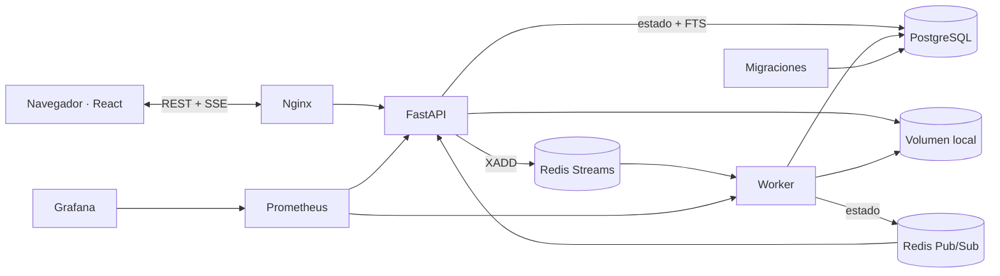

# DocSearch — buscador y visor de documentos técnicos

Aplicación Full Stack —presentada en la interfaz como **Atlas Docs**— para
cargar TXT, Markdown y PDF con metadatos, procesarlos en segundo plano, buscar
sobre título/metadatos/contenido y leerlos sin descargarlos. Implementa
PostgreSQL Full-Text Search con índice GIN —sin `LIKE`— y notificaciones SSE
sin polling.

## Arquitectura en una vista



El camino de búsqueda es deliberadamente simple: React → FastAPI →
PostgreSQL FTS. Redis y el worker solo participan en ingestión y no pueden
bloquear consultas sobre documentos ya indexados.

## Requisitos cubiertos

- carga individual y masiva de TXT, Markdown y PDF, con metadatos por archivo;
- validación de contrato, extensión, tamaño, archivo vacío, firma PDF y
  contenido binario básico;
- respuesta `202 PROCESSING` sin esperar extracción ni indexación;
- resultado parcial `REJECTED`/`ERROR` por elemento de lote;
- búsqueda sobre título, metadatos y contenido con GIN, ranking, paginación y
  resaltado, sin `LIKE`/`ILIKE`;
- visor de contenido y metadatos sin descarga obligatoria;
- estados durables y actualización por SSE sin polling;
- Redis Streams con consumer group, ACK, recuperación de pendientes,
  reintentos y DLQ;
- trazabilidad mediante `document_id`, `correlation_id` y `batch_id`;
- pruebas unitarias, contratos e integración real reproducibles en Compose;
- métricas de API/worker y dashboard Grafana opcional.

## Inicio rápido

Requisitos: Docker Desktop con Docker Compose.

```powershell
docker compose up --build
```

Cuando los servicios estén saludables:

- aplicación: <http://localhost:3000>
- OpenAPI: <http://localhost:8000/docs>
- salud: <http://localhost:8000/health>
- métricas Prometheus: <http://localhost:8000/metrics>

El perfil opcional de observabilidad levanta Prometheus y un dashboard Grafana aprovisionado:

```powershell
docker compose --profile observability up -d
```

- Prometheus: <http://localhost:9090>
- Grafana: <http://localhost:3001> (`admin` / `admin`, sólo para la demo local)

Prometheus consulta la API y el endpoint interno `worker:9101`. El dashboard
incluye p95 de búsqueda/procesamiento, tráfico, cargas, profundidad del stream,
reintentos, pendientes y DLQ.

No es necesario crear `.env` para la demo; `compose.yml` incluye valores locales seguros por defecto. Para personalizarlos:

```powershell
Copy-Item .env.example .env
```

## Demostración sugerida

1. Abre **Cargar** y selecciona uno o varios archivos, por ejemplo `samples/architecture-guide.md`.
2. Completa título, autor, categoría, etiquetas y versión.
3. Comprueba el resumen del lote, su `batch_id` y que cada documento aceptado
   cambia de `PROCESSING` a `INDEXED` mediante SSE, sin refrescar.
4. Busca `arquitectura pagos`, revisa tiempo, ranking y resaltado.
5. Abre el resultado y muestra el contenido y sus metadatos en el visor.
6. Desde OpenAPI intenta cargar una extensión no permitida para mostrar el
   `422`; opcionalmente carga un PDF corrupto con cabecera `%PDF-` para enseñar
   retries, `ERROR` y DLQ.

También puede cargarse por API:

```powershell
$response = Invoke-RestMethod `
  -Uri http://localhost:8000/api/documents `
  -Method Post `
  -Form @{
    file = Get-Item .\samples\architecture-guide.md
    title = 'Arquitectura de pagos'
    author = 'Equipo de Plataforma'
    category = 'Arquitectura'
    tags = '["backend","pagos","redis"]'
    version = '1.0'
  }

$response
```

## API principal

| Método | Ruta | Uso |
|---|---|---|
| `POST` | `/api/documents` | Carga multipart; devuelve `202 PROCESSING` |
| `POST` | `/api/documents/batch` | Lote con metadata por archivo, `batch_id` y éxito parcial |
| `GET` | `/api/documents/{id}/events` | Stream SSE de `INDEXED`/`ERROR` |
| `GET` | `/api/documents/{id}/status` | Estado durable para diagnóstico |
| `GET` | `/api/documents/search?q=...&page=1&page_size=10` | FTS paginado y resaltado |
| `GET` | `/api/documents/{id}` | Contenido y metadatos para el visor |

Los límites predeterminados son 10 MB por archivo, 20 archivos y 50 MB por
lote. Los formatos permitidos son `.txt`, `.md` y `.pdf` con texto extraíble.
La respuesta y los eventos conservan `correlation_id`; una carga masiva añade
`batch_id`. Nginx admite 55 MB para cubrir el lote y el overhead multipart; si
se aumenta `MAX_BATCH_SIZE_MB`, también debe ajustarse
`client_max_body_size`.

## Full-Text Search sin `LIKE`

PostgreSQL mantiene un `tsvector` ponderado mediante trigger: título con peso
A; autor, categoría, etiquetas y versión con peso B; contenido con peso C. La
consulta real usa `websearch_to_tsquery`, el operador `@@`, `ts_rank_cd` y
`ts_headline` sobre un índice GIN.

```sql
WHERE search_vector @@ websearch_to_tsquery('spanish', :query)
```

Esto proporciona normalización lingüística, ranking y fragmentos resaltados.
La prueba automatizada inspecciona el adaptador SQL y falla si aparece
`LIKE`/`ILIKE` en la búsqueda documental.

## Verificación

Pruebas unitarias, contratos e integración real con PostgreSQL, Redis, worker,
SSE y DLQ:

```powershell
docker compose --profile test run --rm tests
```

Resultado de la última ejecución completa: **21 passed** —18 pruebas
unitarias/de contrato y 3 integraciones reales—. Las integraciones cubren carga,
SSE, FTS, visor, reintentos, DLQ y éxito parcial de un lote.

El servicio efímero de migraciones se ejecuta antes de API y worker. Las
migraciones aplicadas se registran en `schema_migrations`.

Smoke test del flujo completo:

```powershell
.\scripts\smoke.ps1
```

Build del frontend:

```powershell
docker compose build frontend
```

Benchmark de búsqueda, con el stack en ejecución y al menos un documento indexado:

```powershell
py .\scripts\benchmark_search.py --query arquitectura --requests 100 --concurrency 10
```

El reporte muestra media, p50, p95, p99 y falla con código distinto de cero si p95 supera 1000 ms. Una respuesta menor a 400 ms se considera mejor que el objetivo; no se agrega demora artificial.

## Estructura

| Ruta | Responsabilidad |
|---|---|
| `backend/app/api/` | Contratos HTTP, DTO y composición de dependencias |
| `backend/app/domain/` | Estados, metadatos y reglas puras |
| `backend/app/application/` | Casos de uso de carga, búsqueda y procesamiento |
| `backend/app/ports/` | Protocolos requeridos por los casos de uso |
| `backend/app/infrastructure/` | PostgreSQL, Redis, almacenamiento, migraciones y métricas |
| `backend/app/workers/` | Consumidor y orquestación asíncrona |
| `backend/db/` | Esquema inicial y migraciones versionadas |
| `frontend/` | React, Nginx, carga, búsqueda, paginación y visor |
| `observability/` | Prometheus y dashboard Grafana |
| `scripts/` | Smoke test y benchmark reproducible |
| `docs/` | Arquitectura y declaración de uso de IA |
| `compose.yml` | Entorno reproducible y perfiles opcionales |

## Decisiones clave

- **PostgreSQL FTS:** está permitido por la prueba, mantiene una única fuente de verdad y ofrece índice invertido GIN, ranking y `ts_headline`.
- **Redis Streams:** consumer group, ACK, reintentos, recuperación de pendientes y dead-letter stream con menor costo operativo que Kafka para este alcance.
- **SSE:** el flujo requerido es servidor → navegador; WebSocket añadiría complejidad sin beneficio funcional.
- **Worker separado:** parsing e indexación nunca bloquean la respuesta HTTP de carga.
- **Dependencias hacia adentro:** los casos de uso no conocen FastAPI,
  PostgreSQL, Redis ni almacenamiento local; reciben puertos pequeños y se
  prueban con dobles simples.
- **Trazabilidad durable:** `correlation_id` y `batch_id` viajan por respuesta,
  PostgreSQL, Redis Streams, logs y SSE, incluso después de una reconexión.
- **Migraciones antes del arranque:** un servicio efímero registra los cambios
  aplicados en `schema_migrations` antes de iniciar API y worker.

## Código limpio, SOLID y DRY

- **SRP:** rutas, casos de uso, persistencia, mensajería, almacenamiento y
  extracción tienen responsabilidades separadas.
- **DIP:** los casos de uso dependen de puertos propios, no de PostgreSQL,
  Redis, FastAPI o filesystem.
- **ISP:** los protocolos se orientan a las operaciones que consume la
  aplicación y evitan repositorios genéricos.
- **OCP/LSP:** un adaptador puede sustituirse detrás de su contrato cuando
  exista una necesidad comprobada.
- **DRY:** estados, normalización, compensaciones y configuración tienen una
  fuente definida, sin capas de paso creadas solo para aparentar arquitectura.

## Seguridad y validaciones

- extensión permitida, tamaño, archivo vacío, firma básica PDF y detección de
  datos binarios en TXT/Markdown;
- nombres internos UUID y archivos fuera del directorio público;
- metadatos y límites de lote validados;
- consultas SQL parametrizadas, CORS configurable y errores internos sin
  detalles sensibles;
- request limit y rate limit en Nginx;
- secretos mediante variables de entorno; `.env` no se versiona.

Autenticación, antivirus y TLS terminan fuera del alcance de la demo. Para un
despliegue real se integrarían OIDC/JWT, RBAC, análisis antimalware y TLS en el
proxy o balanceador.

Si los puertos predeterminados están ocupados por otro proyecto, pueden
configurarse sin modificar Compose:

```powershell
$env:DOCSEARCH_BACKEND_PORT = '18000'
$env:DOCSEARCH_FRONTEND_PORT = '13000'
docker compose up --build
```

## Documentación

- [Arquitectura, flujos, decisiones y evolución](docs/architecture.md)
- [Uso transparente de inteligencia artificial](docs/ia.md)
- [Reglas y norte arquitectónico para agentes](AGENTS.md)

## Limitaciones conocidas

- Los PDF escaneados sin capa de texto requieren OCR, fuera del alcance actual.
- No se implementó autenticación; para producción se propone OIDC/JWT y RBAC.
- Redis Pub/Sub no conserva notificaciones, por eso el estado durable vive en PostgreSQL y el SSE siempre entrega un snapshot inicial.
- PostgreSQL + Redis constituyen un dual write: existe compensación si falla el
  envío, pero una caída entre commit y `XADD` requeriría un outbox para cerrar
  completamente la ventana.
- El no-op de documentos ya `INDEXED` protege redeliveries secuenciales, no dos
  procesamientos concurrentes del mismo documento.
- El volumen local permite compartir archivos dentro del mismo host Compose;
  el escalado multinodo requiere S3/MinIO o almacenamiento compartido.

## Reinicio limpio del entorno

Sólo si se desea eliminar todos los documentos y datos locales de la demo:

```powershell
docker compose down -v
```

## Criterio de ingeniería

> Si una tecnología no puede justificarse en 20–30 segundos indicando qué
> problema concreto resuelve dentro de DocSearch, no se agrega.

El objetivo no es acumular componentes, sino entregar una solución funcional,
medible, segura, probada, mantenible y defendible.
