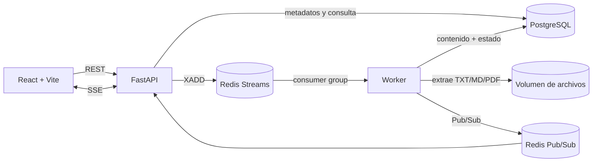

# Arquitectura

## Objetivo y decisiones

La solución prioriza el camino crítico evaluado: recibir documentos de forma asíncrona, indexarlos y responder búsquedas full-text en menos de un segundo. Se eligió una arquitectura modular inspirada en Clean/Hexagonal: separa reglas, casos de uso, puertos y adaptadores sin multiplicar servicios innecesarios.



## Arquitectura interna y dirección de dependencias

```text
api ───────────────> application ───────────────> domain
 │                         │                        ▲
 │                         └────────> ports ────────┘
 └─ composition root ───────────────> infrastructure
workers ──> application + infrastructure
```

- `domain/`: estados, metadatos y reglas puras; no conoce FastAPI, Redis,
  PostgreSQL ni filesystem.
- `application/`: casos de uso de carga, consulta y procesamiento; coordina
  puertos y define compensaciones, pero no instancia adaptadores.
- `ports/`: protocolos pequeños exigidos por los casos de uso. No contiene
  repositorios genéricos ni interfaces sin consumidor.
- `infrastructure/`: adaptadores concretos de PostgreSQL, Redis, disco,
  extracción, configuración y métricas.
- `api/`: DTO, validación HTTP, traducción de errores y dependencias. El
  ensamblaje de casos de uso con adaptadores se concentra en
  `api/dependencies.py`.
- `workers/`: consumidor de Redis Streams y composición del caso de uso de
  procesamiento.

La regla es que `domain` y `application` nunca importen infraestructura. Esto
permite probar las reglas y la orquestación con dobles pequeños, mientras las
pruebas de integración se reservan para PostgreSQL, Redis y SSE. La separación
aplica inversión de dependencias donde existe una razón concreta de prueba o
evolución; no intenta convertir cada función en una interfaz.

## Flujo de carga y tiempo real

1. FastAPI valida extensión, tamaño, firma básica del contenido y metadatos.
2. Guarda el archivo con un UUID interno, calcula SHA-256 y registra `PROCESSING`, `correlation_id` y el `batch_id` opcional en PostgreSQL.
3. Publica un evento versionado en Redis Streams y responde `202` inmediatamente.
4. El worker extrae el texto y actualiza el documento. El trigger de PostgreSQL construye el `tsvector`.
5. El worker conserva la correlación durante reintentos y DLQ, publica `INDEXED` o `ERROR`; FastAPI retransmite el evento por SSE y React actualiza la vista sin polling.

La carga masiva acepta metadata por elemento y devuelve un resultado por
archivo. Un elemento inválido queda `REJECTED` sin revertir los aceptados. El
frontend abre una suscripción SSE por cada documento en `PROCESSING`.

Redis Streams se eligió en lugar de una lista simple porque ofrece consumer groups, ACK, recuperación de mensajes pendientes y una DLQ. Kafka sería apropiado si existieran múltiples dominios consumidores, replay prolongado o un volumen que justificara su costo operativo. Para el alcance de un día, Streams cubre el problema con menos infraestructura.

## Búsqueda

PostgreSQL es la fuente de verdad y también el motor permitido por la prueba. Un trigger genera un `tsvector` ponderado:

- título: peso A;
- autor, categoría, etiquetas y versión: peso B;
- contenido: peso C.

Un índice GIN evita barridos completos. La consulta utiliza `websearch_to_tsquery`, `@@`, `ts_rank_cd` y `ts_headline`; no usa `LIKE`. La búsqueda es síncrona y no pasa por la cola. La API devuelve paginación, total, ranking, fragmentos resaltados y tiempo medido.

El SLA se interpreta como un máximo de un segundo: no se agrega latencia artificial cuando una búsqueda responde en menos de 400 ms. `scripts/benchmark_search.py` reporta p50, p95 y p99; el criterio automatizado exige p95 menor o igual a 1000 ms.

## Errores y resiliencia

- Validaciones retornan `422`; recursos inexistentes, `404`; errores no controlados, un contrato `500` sin filtrar detalles internos.
- El worker es idempotente: si un documento ya está `INDEXED`, no lo reprocesa.
- Un mensaje sin ACK por caída del worker puede ser reclamado tras 60 segundos.
- Cada trabajo admite tres intentos; al agotarlos pasa a `documents:dead-letter` y el documento queda `ERROR`.
- Un servicio efímero aplica migraciones versionadas antes de iniciar API y
  worker, y registra cada archivo en `schema_migrations`.
- PostgreSQL conserva el estado fuente de verdad. Redis sólo transporta trabajos y notificaciones.

## Seguridad

- Lista explícita TXT/MD/PDF, máximo configurable y revisión de firma `%PDF`/contenido binario.
- Nombres de almacenamiento UUID y archivos fuera del directorio público.
- SHA-256 para trazabilidad y futura deduplicación.
- Consultas parametrizadas con psycopg.
- Nginx aplica límite de tamaño y rate limiting.
- CORS se configura por ambiente.

Autenticación y antivirus quedan fuera del alcance funcional. En producción se integrarían OIDC/JWT con roles `ADMIN`/`USER` y un escáner como ClamAV antes de publicar el trabajo.

## Relación con los criterios de evaluación

- **Código limpio:** responsabilidades separadas, nombres orientados al caso de
  uso y un único composition root HTTP.
- **SOLID/DRY:** dominio y aplicación dependen de protocolos propios; las
  validaciones y compensaciones viven en un solo lugar.
- **Seguridad y validaciones:** la API valida metadatos y el adaptador de
  almacenamiento valida extensión, tamaño, firma y contenido básico.
- **Sustentación:** cada adaptador responde a una necesidad del flujo y puede
  sustituirse sin alterar el contrato REST.
- **Pruebas unitarias:** los casos de uso se prueban sin PostgreSQL, Redis o
  filesystem real; las integraciones reales complementan esa cobertura.

## Escalabilidad

- API, frontend y workers son escalables horizontalmente.
- Redis consumer groups distribuye documentos entre workers.
- PostgreSQL puede incorporar réplicas de lectura y particionamiento; el índice GIN mantiene la consulta indexada.
- Los archivos pueden migrar del volumen local a S3/MinIO detrás de la misma abstracción.
- Si la carga supera la capacidad de PostgreSQL FTS, el puerto de búsqueda puede implementarse con OpenSearch/Elasticsearch sin cambiar el contrato REST.

## Observabilidad

`/metrics` expone métricas Prometheus de tasa y latencia HTTP, histograma específico de búsqueda, cargas aceptadas y longitud del stream. El worker expone en el puerto interno `9101` duración de procesamiento, resultados, reintentos, DLQ y mensajes pendientes. El perfil opcional `observability` levanta Prometheus y un dashboard Grafana aprovisionado con estas señales. Los logs del worker incluyen documento, correlación, lote, intento y errores de extracción.

## Capacidades opcionales

La búsqueda semántica, RAG y Ollama del proyecto de referencia son una evolución válida, pero permanecen fuera del camino obligatorio. Primero se garantiza full-text, visor y tiempo real; después puede añadirse recuperación híbrida (FTS + vectores mediante RRF) como endpoint independiente.
