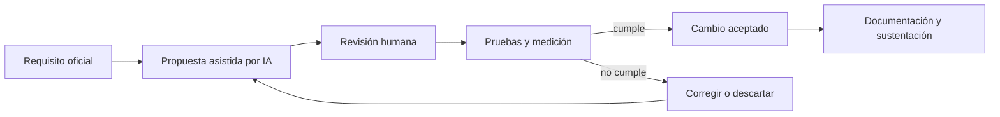

# Uso de inteligencia artificial

## Herramientas utilizadas

Se utilizó ChatGPT/Codex como asistente de análisis y desarrollo. También se consultó un documento de arquitectura elaborado previamente mediante interacción con ChatGPT. El proyecto `chatbot` existente se usó como referencia local para patrones de FastAPI, procesamiento PDF, SSE, React y observabilidad.

La IA actuó como herramienta de apoyo; las decisiones, credenciales,
ejecuciones locales y aceptación final permanecieron bajo control humano. No
se incorporó un modelo de IA, RAG, embeddings ni un LLM al runtime de la
aplicación.

## Casos de uso

- Extracción y organización de los requisitos del PDF suministrado.
- Comparación del alcance obligatorio con la arquitectura RAG existente.
- Generación del esqueleto de backend, frontend, pruebas y documentación.
- Reorganización hacia una arquitectura modular con dominio, casos de uso,
  puertos y adaptadores.
- Implementación y revisión de carga masiva, trazabilidad durable,
  migraciones, métricas del worker y dashboard.
- Revisión de riesgos: búsqueda sin `LIKE`, latencia, seguridad de archivos, reintentos y DLQ.
- Creación y depuración de pruebas unitarias, contratos e integraciones reales.
- Preparación de un benchmark reproducible, documentación y argumentos para
  la sustentación.

## Flujo de validación

## Prompts clave y refinamiento

Prompts representativos del proceso:

> Crea un proyecto para la prueba técnica usando lo reutilizable del proyecto chatbot y siguiendo los lineamientos del PDF.

> ¿Kafka es necesario para el proceso asíncrono o cuál alternativa propones?

> Identifica qué aspectos adicionales pueden dar más puntos aprovechando que no se parte desde cero.

> Mejora AGENTS.md como norte arquitectónico y después reorganiza el código sin perder las capacidades existentes.

> Incorpora los criterios comunicados por correo: código limpio, SOLID/DRY, seguridad y validaciones, sustentación y pruebas unitarias.

> Implementa carga masiva, correlation_id, métricas del worker y pruebas de integración sobre la arquitectura reorganizada.

El primer planteamiento se refinó para separar el camino obligatorio de búsqueda full-text de las capacidades RAG. Kafka se sustituyó por Redis Streams al no requerirse replay prolongado ni múltiples dominios consumidores. La búsqueda se mantuvo en PostgreSQL FTS, opción autorizada expresamente por la prueba, para reducir riesgo operativo. Posteriormente se priorizó una reorganización incremental sobre una reescritura desde cero, conservando los contratos funcionales ya verificados.

## Validación humana

Cada propuesta se contrastó con el PDF y con los criterios enviados por correo:
código limpio, SOLID/DRY, seguridad y validaciones, sustentación y pruebas
unitarias. Se revisaron manualmente el esquema SQL, la ausencia de `LIKE`, el
contrato REST, el flujo SSE, la configuración Docker, las migraciones y la
separación entre estado durable y transporte de eventos.

La última verificación completa ejecutada dentro de Docker obtuvo `21 passed`:
18 pruebas unitarias/de contrato y 3 integraciones reales. También se validaron
el build del frontend, la configuración Compose, el dashboard JSON y las
métricas expuestas por el worker. Esta evidencia reduce el riesgo de aceptar
afirmaciones generadas por IA sin comprobación ejecutable.

Antes de entregar, el candidato debe repetir la verificación descrita en el
README, ejecutar el benchmark con el conjunto de datos de la demostración y
actualizar este documento si utiliza herramientas, modelos o prompts
adicionales. La responsabilidad sobre el código y su sustentación sigue siendo
del candidato.
